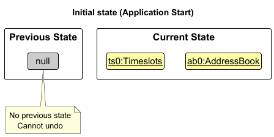
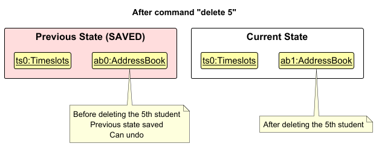
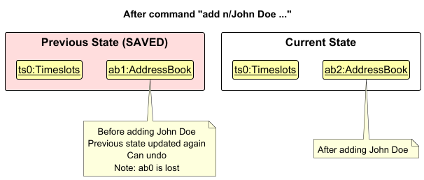
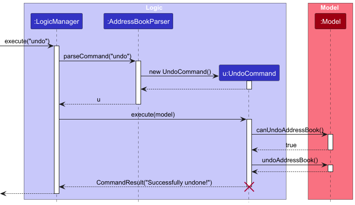
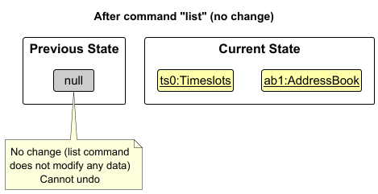
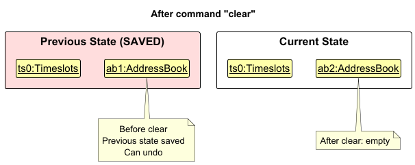
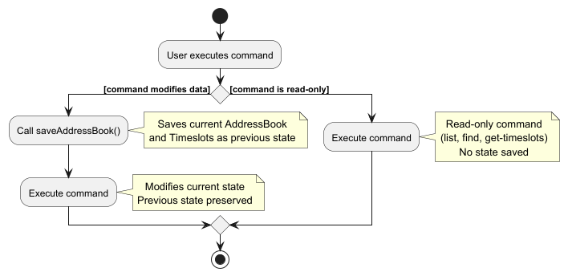

# LambdaLab Developer Guide

<!-- * Table of Contents -->
<page-nav-print />

--------------------------------------------------------------------------------------------------------------------

## **Acknowledgements**

_{ list here sources of all reused/adapted ideas, code, documentation, and third-party libraries -- include links to the original source as well }_

--------------------------------------------------------------------------------------------------------------------

## **Setting up, getting started**

Refer to the guide [_Setting up and getting started_](SettingUp.md).

--------------------------------------------------------------------------------------------------------------------

## **Design**

### Architecture

<puml src="diagrams/ArchitectureDiagram.puml" width="280" />

The ***Architecture Diagram*** given above explains the high-level design of the App.

Given below is a quick overview of main components and how they interact with each other.

**Main components of the architecture**

**`Main`** (consisting of classes [`Main`](https://github.com/se-edu/addressbook-level3/tree/master/src/main/java/seedu/address/Main.java) and [`MainApp`](https://github.com/se-edu/addressbook-level3/tree/master/src/main/java/seedu/address/MainApp.java)) is in charge of the app launch and shut down.
* At app launch, it initializes the other components in the correct sequence, and connects them up with each other.
* At shut down, it shuts down the other components and invokes cleanup methods where necessary.

The bulk of the app's work is done by the following four components:

* [**`UI`**](#ui-component): The UI of the App.
* [**`Logic`**](#logic-component): The command executor.
* [**`Model`**](#model-component): Holds the data of the App in memory.
* [**`Storage`**](#storage-component): Reads data from, and writes data to, the hard disk.

[**`Commons`**](#common-classes) represents a collection of classes used by multiple other components.

**How the architecture components interact with each other**

The *Sequence Diagram* below shows how the components interact with each other for the scenario where the user issues the command `delete 1`.

<puml src="diagrams/ArchitectureSequenceDiagram.puml" width="574" />

Each of the four main components (also shown in the diagram above),

* defines its *API* in an `interface` with the same name as the Component.
* implements its functionality using a concrete `{Component Name}Manager` class (which follows the corresponding API `interface` mentioned in the previous point.

For example, the `Logic` component defines its API in the `Logic.java` interface and implements its functionality using the `LogicManager.java` class which follows the `Logic` interface. Other components interact with a given component through its interface rather than the concrete class (reason: to prevent outside component's being coupled to the implementation of a component), as illustrated in the (partial) class diagram below.

<puml src="diagrams/ComponentManagers.puml" width="300" />

The sections below give more details of each component.

### UI component

The **API** of this component is specified in [`Ui.java`](https://github.com/se-edu/addressbook-level3/tree/master/src/main/java/seedu/address/ui/Ui.java)

<puml src="diagrams/UiClassDiagram.puml" alt="Structure of the UI Component"/>

The UI consists of a `MainWindow` that is made up of parts e.g.`CommandBox`, `ResultDisplay`, `PersonListPanel`, `StatusBarFooter` etc. All these, including the `MainWindow`, inherit from the abstract `UiPart` class which captures the commonalities between classes that represent parts of the visible GUI.

The `UI` component uses the JavaFx UI framework. The layout of these UI parts are defined in matching `.fxml` files that are in the `src/main/resources/view` folder. For example, the layout of the [`MainWindow`](https://github.com/se-edu/addressbook-level3/tree/master/src/main/java/seedu/address/ui/MainWindow.java) is specified in [`MainWindow.fxml`](https://github.com/se-edu/addressbook-level3/tree/master/src/main/resources/view/MainWindow.fxml)

The `UI` component,

* executes user commands using the `Logic` component.
* listens for changes to `Model` data so that the UI can be updated with the modified data.
* keeps a reference to the `Logic` component, because the `UI` relies on the `Logic` to execute commands.
* depends on some classes in the `Model` component, as it displays `Person` object residing in the `Model`.

### Logic component

**API** : [`Logic.java`](https://github.com/se-edu/addressbook-level3/tree/master/src/main/java/seedu/address/logic/Logic.java)

Here's a (partial) class diagram of the `Logic` component:

<puml src="diagrams/LogicClassDiagram.puml" width="550"/>

The sequence diagram below illustrates the interactions within the `Logic` component, taking `execute("delete 1")` API call as an example.

<puml src="diagrams/DeleteSequenceDiagram.puml" alt="Interactions Inside the Logic Component for the `delete 1` Command" />

<box type="info" seamless>

**Note:** The lifeline for `DeleteCommandParser` should end at the destroy marker (X) but due to a limitation of PlantUML, the lifeline continues till the end of diagram.
</box>

How the `Logic` component works:

1. When `Logic` is called upon to execute a command, it is passed to an `AddressBookParser` object which in turn creates a parser that matches the command (e.g., `DeleteCommandParser`) and uses it to parse the command.
1. This results in a `Command` object (more precisely, an object of one of its subclasses e.g., `DeleteCommand`) which is executed by the `LogicManager`.
1. The command can communicate with the `Model` when it is executed (e.g. to delete a person). 
   Note that although this is shown as a single step in the diagram above (for simplicity), in the code it can take several interactions (between the command object and the `Model`) to achieve.
1. The result of the command execution is encapsulated as a `CommandResult` object which is returned back from `Logic`.

Here are the other classes in `Logic` (omitted from the class diagram above) that are used for parsing a user command:

<puml src="diagrams/ParserClasses.puml" width="600"/>

How the parsing works:
* When called upon to parse a user command, the `AddressBookParser` class creates an `XYZCommandParser` (`XYZ` is a placeholder for the specific command name e.g., `AddCommandParser`) which uses the other classes shown above to parse the user command and create a `XYZCommand` object (e.g., `AddCommand`) which the `AddressBookParser` returns back as a `Command` object.
* All `XYZCommandParser` classes (e.g., `AddCommandParser`, `DeleteCommandParser`, ...) inherit from the `Parser` interface so that they can be treated similarly where possible e.g, during testing.

### Model component
**API** : [`Model.java`](https://github.com/se-edu/addressbook-level3/tree/master/src/main/java/seedu/address/model/Model.java)

<puml src="diagrams/ModelClassDiagram.puml" width="450" />

The `Model` component,

* stores the address book data i.e., all `Person` objects (which are contained in a `UniquePersonList` object).
* stores the currently 'selected' `Person` objects (e.g., results of a search query) as a separate _filtered_ list which is exposed to outsiders as an unmodifiable `ObservableList<Person>` that can be 'observed' e.g. the UI can be bound to this list so that the UI automatically updates when the data in the list change.
* stores a `UserPref` object that represents the user’s preferences. This is exposed to the outside as a `ReadOnlyUserPref` objects.
* does not depend on any of the other three components (as the `Model` represents data entities of the domain, they should make sense on their own without depending on other components)

<box type="info" seamless>

**Note:** An alternative (arguably, a more OOP) model is given below. It has a `Tag` list in the `AddressBook`, which `Person` references. This allows `AddressBook` to only require one `Tag` object per unique tag, instead of each `Person` needing their own `Tag` objects. 

<puml src="diagrams/BetterModelClassDiagram.puml" width="450" />

</box>

### Storage component

**API** : [`Storage.java`](https://github.com/se-edu/addressbook-level3/tree/master/src/main/java/seedu/address/storage/Storage.java)

<puml src="diagrams/StorageClassDiagram.puml" width="550" />

The `Storage` component,
* can save address book data, user preferences, and timeslot data in JSON format and read them back into model objects.
* inherits from `AddressBookStorage`, `UserPrefsStorage`, and `TimeslotsStorage`, which means it can be treated as either one (if only the functionality of only one is needed).
* depends on some classes in the Model component (because the Storage component's job is to save/retrieve objects that belong to the Model)
* delegates JSON conversion to classes such as `JsonSerializableAddressBook` / `JsonAdaptedPerson` for the address book and `JsonSerializableTimeslots` / `JsonAdaptedTimeslot` for timeslots.
* provides concrete implementations like `JsonAddressBookStorage`, `JsonUserPrefsStorage`, and `JsonTimeslotsStorage` which read/write files on disk.

The `StorageManager` class,
* composes the individual storage providers (address book, prefs, timeslots)
* exposes unified operations so `MainApp`, `Logic`, and other components access persistence through a single entry point

The timeslots file location is configurable via `UserPrefs` and the application will create or populate the file with sample timeslots when none is present.

### Common classes

Classes used by multiple components are in the `seedu.address.commons` package.

--------------------------------------------------------------------------------------------------------------------

## **Implementation**

This section describes some noteworthy details on how certain features are implemented.
## Timeslots features

### Implementation
The Timeslots feature is implemented as a set of commands that parse user input into command objects, interact with the Model to read or mutate the stored timeslots, and return a CommandResult.  The key behaviours
are:

- Blocking (adding) a timeslot: parser constructs BlockTimeslotCommand which validates and then adds a Timeslot
  to the model (persisting prior state for undo).
- Adding a consultation: Similar to blocking a timeslots but it uses AddConsultationCommand and ConsultationTimeslot instead

Sequence Diagram for block timeslot command:
<puml src="diagrams/BlockTimeslotSequenceDiagram.puml" width="574" />

- Unblocking (removing/trimming) a timeslot: parser constructs UnblockTimeslotCommand which computes overlapping
  stored timeslots, then removes/trims/splits them as needed, persisting prior state.

Sequence Diagram for unblock timeslot command:
<puml src="diagrams/UnblockTimeslotSequenceDiagram.puml" width="574" />

- Clearing all timeslots: ClearTimeslotsCommand clears the stored timeslots after persisting prior state.
Sequence Diagram for clear timeslots command:
<puml src="diagrams/ClearTimeslotSequenceDiagram.puml" width="574" />

- Retrieving timeslots/consultations: read-only commands that fetch timeslots from the Model and format them for display; they do not modify state and therefore do not call save.
Sequence Diagram for get timeslots command:
<puml src="diagrams/GetTimeslotsSequenceDiagram.puml" width="574" />

### Undo feature

#### Implementation

The undo mechanism is facilitated by `ModelManager`. It stores a single previous state of the address book and
timeslots, stored internally as `previousAddressBookState` and `previousTimeslotsState`. Additionally, it implements
the following operations:

* `Model#saveAddressBook()` — Saves the current address book and timeslots state before modification.
* `Model#undoAddressBook()` — Restores the previous address book and timeslots state.
* `Model#canUndoAddressBook()` — Checks if there is a previous state available to undo to.

These operations are exposed in the `Model` interface as `Model#saveAddressBook()`, `Model#undoAddressBook()` and
`Model#canUndoAddressBook()` respectively.

Given below is an example usage scenario and how the undo mechanism behaves at each step.

**Step 1.** The user launches the application for the first time. The `ModelManager` will be initialized with the
initial address book and timeslots state, with `previousAddressBookState` and `previousTimeslotsState` set to `null`
(no previous state to undo to).

**Step 2.** The user executes `delete 5` command to delete the 5th person in the address book. The `delete` command
calls `Model#saveAddressBook()` before deleting, saving the current state. After the deletion, the current state is
modified but the previous state preserves the state before deletion.

<box type="info" seamless>

**Note:** If a command fails its execution, it will not call `Model#saveAddressBook()`, so the previous state will
not be updated.

</box>

**Step 3.** The user executes `add n/John Doe …​` to add a new student. The `add` command also calls
`Model#saveAddressBook()` before adding, which **replaces** the previous state with the current state (ab1),
then adds the new student.

**Step 4.** The user now decides that adding the student was a mistake, and decides to undo that action by
executing the `undo` command. The `undo` command will call `Model#undoAddressBook()`, which restores the address book
to the previous state (ab1) and sets both `previousAddressBookState` and `previousTimeslotsState` to `null`.

<box type="info" seamless>

**Note:** If `previousAddressBookState` is `null`, then there is no previous state to restore. The `undo` command
uses `Model#canUndoAddressBook()` to check if this is the case. If so, it will return an error to the user rather than
attempting to perform the undo.

</box>

<box type="warning" seamless>

**Important:** This implementation only supports undoing **one command** at a time. After undoing once, you must
execute another modifying command before you can undo again. There is no redo functionality.

</box>

The following sequence diagram shows how an undo operation goes through the `Logic` component:

<box type="info" seamless>

**Note:** The lifeline for `UndoCommand` should end at the destroy marker (X) but due to a limitation of PlantUML,
the lifeline reaches the end of diagram.

</box>

Similarly, how an undo operation goes through the `Model` component is shown below:

**Step 5.** The user then decides to execute the command `list`. Commands that do not modify the address book,
such as `list`, `find`, or `get-timeslots`, will not call `Model#saveAddressBook()`. Thus, the previous state remains `null`.

**Step 6.** The user executes `clear`, which calls `Model#saveAddressBook()` before clearing. The current state (ab1)
is saved as the previous state, then all persons are deleted, creating a new current state.

The following activity diagram summarises what happens when a user executes a new command:

#### Commands that support undo

The following commands call `Model#saveAddressBook()` and thus support undo:
- `add` - Adds a student
- `delete` - Deletes a student
- `edit` - Edits a student
- `clear` - Clears all students
- `marke` - Marks an exercise
- `marka` - Marks attendance
- `grade` - Marks grade of an assessment
- `block-timeslot` - Adds a timeslot
- `clear-timeslots` - Clears all timeslots

The following commands do NOT support undo (read-only commands):
- `list` - Lists all students
- `find` - Finds students
- `filter` - Filters students
- `sort` - Sorts students base on some criteria
- `get-timeslots` - Displays timeslots
- `help` - Shows help
- `exit` - Exits the application

#### Design considerations

**Aspect: How undo executes:**

* **Alternative 1 (current choice):** Saves only one previous state (address book + timeslots).
    * Pros:
        * Simple to implement and understand.
        * Minimal memory usage (only doubles the data size at most).
        * No complex state management or pointer tracking.
    * Cons:
        * Cannot undo multiple commands in sequence.
        * Cannot undo a command once a new data-modifying command is executed.
        * No redo functionality.

* **Alternative 2:** Save entire history in a list with pointer.
    * Pros:
        * Can undo multiple commands in sequence.
        * Supports redo functionality.
    * Cons:
        * More complex to implement and maintain.
        * Higher memory usage (stores multiple states in a list).
        * Need to carefully manage state pointer and list boundaries.

* **Alternative 3:** Individual command knows how to undo itself (Command Pattern with undo).
    * Pros:
        * Memory efficient (only store minimal data needed to reverse each command).
        * Can undo multiple commands.
        * Each command encapsulates its own undo logic.
    * Cons:
        * Much more complex - every command must implement its own undo logic.
        * Must ensure correctness of each command's undo implementation.
        * Harder to maintain and test.
        * Increased development time for new commands.

**Rationale for Alternative 1:** For the scope of this project, a simple single-level undo is sufficient for most use
cases. Users typically need to undo only their most recent action, and the simplicity of implementation outweighs the
benefits of a full undo/redo stack. The minimal memory overhead and straightforward logic make this approach ideal for
a student project with limited development time.

#### Future enhancements

* **Multiple undo levels:** Implement a full history stack (Alternative 2) to support undoing multiple commands in
  sequence. This would involve storing a list of states and maintaining a current state pointer.

* **Redo functionality:** Allow users to redo commands that were undone. This would require preserving the "future"
  states after an undo operation until a new modifying command is executed.

* **Selective undo:** Allow undoing specific commands in history rather than just the most recent one. This would
  require implementing Alternative 3 with command-specific undo logic.

* **Undo command confirmation:** For destructive commands like `clear`, prompt the user to confirm before executing,
  reducing the need for undo in the first place.

### \[Proposed\] Data archiving

_{Explain here how the data archiving feature will be implemented}_

### Find Feature:

<puml src="diagrams/findCommand/find.puml" width="250" />

--------------------------------------------------------------------------------------------------------------------

## **Documentation, logging, testing, configuration, dev-ops**

* [Documentation guide](Documentation.md)
* [Testing guide](Testing.md)
* [Logging guide](Logging.md)
* [Configuration guide](Configuration.md)
* [DevOps guide](DevOps.md)

--------------------------------------------------------------------------------------------------------------------

## **Appendix: Requirements**

### Product scope

**Target user profile**:

* Undergraduate Teaching Assistants of CS2030S
* need to manage a significant number of students
* prefer desktop apps for reliability during labs/consultations
* can type fast and are comfortable with keyboard shortcuts (Vim)
* prefer typing over mouse interactions
* comfortable using CLI apps

**Value proposition**: manage students, submissions, attendance, and resources faster and more efficiently than traditional spreadsheets or GUI-based systems

### User stories

Priorities: High (must have) - `* * *`, Medium (nice to have) - `* *`, Low (unlikely to have) - `*`

| Priority | As a …​                                   | I want to …​                                                                              | So that I can…​                                                                                        |
|----------|-------------------------------------------|-------------------------------------------------------------------------------------------|--------------------------------------------------------------------------------------------------------|
| `* * *`  | CS2030S TA                                | add a GitHub username to the student                                                      | track their exercises easily (auto-link)                                                               |
| `* * *`  | Grader                                    | mark student's exercise as graded after grading it                                        | know which students' exercises are graded / not graded yet                                             |
| `* * *`  | New user                                  | receive help from the app                                                                 | learn how to use it quickly                                                                            |
| `* * *`  | TA                                        | search for students based on their name                                                   | easily find the student im looking for                                                                 |
| `* * *`  | TA                                        | delete student's information                                                              | remove false information                                                                               |
| `* * *`  | TA conducting labs                        | mark students attendance                                                                  | know which students attended the lab and which students didnt                                          |
| `* * *`  | TA with many students                     | add, update students data                                                                 | have their accurate information in LambdaLabs                                                          |
| `* *`    | Grader                                    | tag my student based on their exercise performance                                        | know how much effort I would need to help each student                                                 |
| `* *`    | New user                                  | input student data quickly                                                                | focus on teaching                                                                                      |
| `* *`    | New user                                  | undo my mistakes                                                                          | recover from them quickly                                                                              |
| `* *`    | TA                                        | review statistics regarding performance                                                   | see if the class has room for improvement                                                              |
| `* *`    | TA                                        | search for students based on their student ID                                             | easily find the student im looking for                                                                 |
| `* *`    | TA                                        | I can visualise the students' performance through charts and graph                        | see which part students are doing well/lacking at and put a sufficient amount of effort for that topic |
| `* *`    | TA                                        | sort based on alphabetical order                                                          | easily look for a student and his/her data by his/her name                                             |
| `* *`    | TA                                        | I can sort based on students grades                                                       | see who is underperforming and needs help                                                              |
| `* *`    | TA                                        | sort students based on assignment submitted/ graded/ not submitted                        | better visualise the class's progress on current assignment                                            |
| `* *`    | TA                                        | I can sort based on students attendance rate                                              | see who is missing the most classes                                                                    |
| `* *`    | TA                                        | I can add a tag to signal I need to follow up with a student                              | ensure all students are well taught                                                                    |
| `* *`    | TA                                        | I can filter based on specific assignment submissions                                     | check who did which assignment                                                                         |
| `* *`    | TA accepting consultations                | get my available time slots                                                               | schedule consultations easily by allowing students to choose from all my free time                     |
| `* *`    | TA accepting consultations                | block out timeslots by inputting manually                                                 | use the scheduling feature                                                                             |
| `* *`    | TA marking for attendance                 | filter students based on attendance                                                       | accurately grade my students' attendance                                                               |
| `*`      | Experienced user                          | quickly access my students data                                                           | save time                                                                                              |
| `*`      | Experienced user                          | add aliases to commonly used commands                                                     | easily call frequently used commands                                                                   |
| `*`      | Grader                                    | be notified if any new students have submitted the assignment since I last opened the app | grade their exercises promptly                                                                         |
| `*`      | TA                                        | receive notifications if I have class/consultations the next day                          | not miss any classes/consultations                                                                     |
| `*`      | TA who is making my own slides            | add my slides as a link or filepath                                                       | easily retrieve my slides                                                                              |
| `*`      | TA accepting consultations                | block out timeslots by importing the .ics file from NUSMods                               | use the scheduling feature wiithout much setup                                                         |
| `*`      | TA who is teaching for multiple semesters | archive my student data from previous semesters                                           | focus on the current students                                                                          |
| `*`      | TA who is teaching for multiple semesters | unarchive my past student data                                                            | find something that happened in previous semester if I need that                                       |
| `*`      | TA who is teaching multiple semesters     | I can archive my timetable data                                                           | schedule consultations based on current semester's timetable                                           |

### Use cases

(For all use cases below, the **System** is the `LambdaLab` and the **Actor** is the `user`, unless specified otherwise)

**Use case: Grade an exercise**

**Precondition: A student has submitted their programming exercise**

**MSS**

1.  User receives notification that a student has submitted the exercise
2.  User navigates to student's submission on GitHub via notification
3.  User returns after grading student's submission on GitHub
4.  User marks exercise as graded in LambdaLab
5.  LambdaLab updates statistics
    Use case ends.

**Extensions**

* 1a. User doesn't want to grade student's exercise now
    * 1a1. User dismisses the notification
      Use case ends.
* 1b. User accidentally dismisses notification
    * 1b1. User goes to student's profile
    * 1b2. User navigates to student's submission on GitHub via link in student's profile
      Use case resumes at Step 3

**Use case: Mark student attendance**

**MSS**

1.  User wants to mark attendance, enters student name and lab number using the command format
2.  LambdaLab validates the student name and lab number
3.  LambdaLab marks the student’s attendance for the specified lab
4.  LambdaLab confirms: “Attendance for <studentName> marked for lab number <labNumber>”
    Use case ends.

**Extensions**

* 1a. User provides an empty name or a name with invalid characters
    * 1a1. LambdaLab displays error message: “Invalid name”
    * 1a2. User re-enters a valid name
      Use case resumes at Step 2
* 1b. User provides an invalid lab number (non-numeric, zero, negative, or out-of-range)
    * 1b1. System displays error message: “Invalid lab number”
    * 1b2. User re-enters a valid lab number
      Use case resumes at Step 2
* 3a. Attendance for the student in that lab number has already been marked
    * 3a1. LambdaLab displays: “Attendance already marked for <studentName> in lab number <labNumber>”
      Use case ends.

**Use case: Schedule a consultation**

**Precondition: User has uploaded his schedule**

**Actor:User**

**MSS**
1. User views all the periods of available time he has
2. User inputs a desired consultation time slot
3. Time slot is saved into his schedule
4. A day before the consultation, the user will be reminded of it

**Extensions**
* 2a. User inputs an invalid consultation slot
    * 1a1. User is prompted to enter a valid consultation slot
      Use case resumes at step 2.
* 3a.
    * 3a1. User requests to reschedule or delete the consultation.
    * 3a2. System allows modification or cancellation.
      Use case ends.

*{More to be added}*

### Non-Functional Requirements

1.  Should work on any _mainstream OS_ as long as it has Java `17` or above installed.
2.  Should be able to hold up to 1000 persons without a noticeable sluggishness in performance for typical usage.
3.  A user with above average typing speed for regular English text (i.e. not code, not system admin commands) should be able to accomplish most of the tasks faster using commands than using the mouse.
4.  The system should respond to any command within 1 second.
5.  Core functionalities should be covered by automated tests to ensure that future changes do not break the existing features
6.  Users should be able to run the application simply by executing a JAR file, without needing to run an installer.
7.  Should be able to function fully offline.
8.  Date persistence should not depend on an external database system. Storage should be file-based and embedded.
9.  User data should not be lost due to unexpected situations (e.g., unexpected shutdowns).
10. Should be able to support multiple screen resolutions (e.g., 1280×720 and above) without layout issues.

### Glossary

* **Assignment**: Weekly coding homework that is submitted through GitHub
* **Auto-link**: Automatically add a link to the students GitHub repo
* **Consultation**: Scheduled meeting between a TA and student
* **Exercise**: Weekly coding homework that is submitted through GitHub
* **Mainstream OS**: Windows, Linux, Unix, MacOS
* **Students' performance**: Grades that students receive for their weekly exercises and labs
* **TA**: Teaching Assistant

--------------------------------------------------------------------------------------------------------------------

## **Appendix: Instructions for manual testing**

Given below are instructions to test the app manually.

<box type="info" seamless>

**Note:** These instructions only provide a starting point for testers to work on;
testers are expected to do more *exploratory* testing.

</box>

### Launch and shutdown

1. Initial launch

    1. Download the jar file and copy into an empty folder

    1. Double-click the jar file Expected: Shows the GUI with a set of sample contacts. The window size may not be optimum.

1. Saving window preferences

    1. Resize the window to an optimum size. Move the window to a different location. Close the window.

    1. Re-launch the app by double-clicking the jar file. 
       Expected: The most recent window size and location is retained.

1. _{ more test cases …​ }_

### Deleting a person

1. Deleting a person while all persons are being shown

    1. Prerequisites: List all persons using the `list` command. Multiple persons in the list.

    1. Test case: `delete 1` 
       Expected: First contact is deleted from the list. Details of the deleted contact shown in the status message. Timestamp in the status bar is updated.

    1. Test case: `delete 0` 
       Expected: No person is deleted. Error details shown in the status message. Status bar remains the same.

    1. Other incorrect delete commands to try: `delete`, `delete x`, `...` (where x is larger than the list size) 
       Expected: Similar to previous.

1. _{ more test cases …​ }_

### Saving data

1. Dealing with missing/corrupted data files

    1. _{explain how to simulate a missing/corrupted file, and the expected behavior}_

1. _{ more test cases …​ }_

